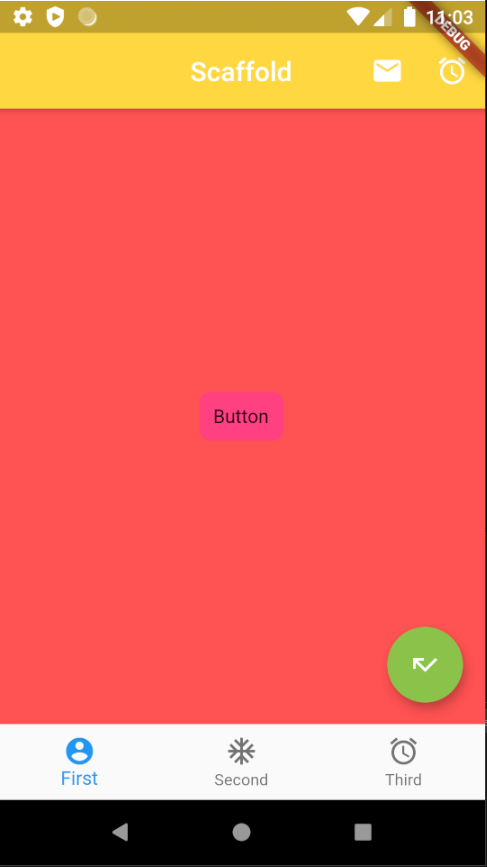

# flutter-learning-1-hello-world
 
First flutter learning project, for learning purposes only. 

Created a home view, used Scaffold, appBar, bottomNavigationBar, snackBar, etc. 

Created functions that result in messages on the screen as well as in the console. 

No planned improvements. 

